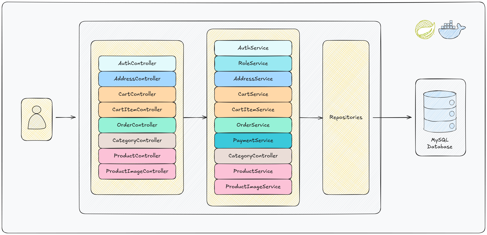

# E-Commerce REST API

This project is an e-commerce REST API built using Java and Spring Boot.
The API allows users to interact with products, manage a shopping cart, handle user authentication,
and perform other essential e-commerce functionalities.

<p align="center">
  
</p>

### Technologies Used

- Java 17
- Spring Boot
- Spring Security with JWT Authentication
- MySQL
- H2 (for testing purposes)
- Maven
- Docker and Docker Compose
- JUnit 5, Mockito and AssertJ for testing
- OpenAPI 3 for API documentation

### Role-Based Access Control

There are three predefined roles for role-based access control:

- **ROLE_USER:** Standard users with access to basic shopping features, including:
    - Managing their shopping cart.
    - Viewing and purchasing products.

- **ROLE_ADMIN:** Administrators responsible for managing the platform's inventory, with permissions to:
    - Add, update, and delete products.
    - Manage product categories.
    - *Note:* Admins cannot access cart or order-related functionalities.

- **ROLE_SUPER_ADMIN:** Super admin is only responsible for managing admins.

### How to Run

Clone the project and navigate to the root directory:

```shell
git clone git@github.com:yusufemrebilgin/e-commerce.git && cd e-commerce
```

**Option 1: Using Maven**

  **1:** Build the application:
  ```shell
  mvn clean install -DskipTests
  ```

  **2.1:** Run the application:
  ```shell
  mvn spring-boot:run
  ```

  **2.2:** Run the application with sample data:
  ```shell
  mvn spring-boot:run -Dspring-boot.run.arguments="--createDummyData=true"
  ```

**Option 2: Using Docker Compose**

  **1:** Define environment variables in the `.env` file:
  ```
  DB_USERNAME=<database_username>
  DB_PASSWORD=<database_password>
  ```

  **2.1:** Build and run the application:
  ```shell
  docker compose up --build
  ```
  **2.2:** Build and run the application with sample data:
  ```shell
  CREATE_DUMMY_DATA=true docker compose up --build
  ```
  
- **Note:** Use the `--build` flag if:
  - You made changes to the Dockerfile or `docker-compose.yaml`
  - You updated any application code, dependencies, or configuration files
  - The existing Docker image does not reflect the latest updates
  <br><br>
- Start the application without rebuilding (if no changes were made):
  ```shell
  docker compose up
  ```

- To stop the application:
  ```shell
  docker compose down
  ```

### Explore the Application

- Default Credentials for the API:
  
  | **Username** | **Password** | **Role**         |
  |--------------|--------------|------------------|
  | admin        | adminpw      | ROLE_SUPER_ADMIN |
  | testuser     | userpw       | ROLE_USER        |

- API Documentation: http://localhost:8080/swagger-ui.html
- Postman Collection: To test the API endpoints, 
  download [collection](https://raw.githubusercontent.com/yusufemrebilgin/e-commerce/main/postman-collection/e-commerce.postman_collection.json) 
  and [environment](https://raw.githubusercontent.com/yusufemrebilgin/e-commerce/main/postman-collection/e-commerce.postman_environment.json) 
  files and import it into Postman for easy testing.
  <br><br>
- **Note:** The application runs on port `8080`. Make sure it is not being used by
  other services.
  <br><br>

- [Endpoints](#endpoints)
- [Example Calls](#example-calls)

### Endpoints

- **AuthController**

  | **Endpoint**            | **Method** | **Description**                                         | **Accessible By** |
  |-------------------------|------------|---------------------------------------------------------|-------------------|
  | `/api/v1/auth/login`    | POST       | Authenticates a user and returns authentication details | Everyone          |
  | `/api/v1/auth/register` | POST       | Registers a new user and returns a success message      | Everyone          |

- **AddressController**

  | **Endpoint**                    | **Method** | **Description**                                        | **Accessible By** |
  |---------------------------------|------------|--------------------------------------------------------|-------------------|
  | `/api/v1/addresses`             | GET        | Retrieve all addresses for the authenticated user      | ROLE_USER         |
  | `/api/v1/addresses`             | POST       | Creates a new address for the authenticated user       | ROLE_USER         |
  | `/api/v1/addresses/{addressId}` | PUT        | Updates an existing address for the authenticated user | ROLE_USER         |
  | `/api/v1/addresses/{addressId}` | DELETE     | Deletes an address for the authenticated user          | ROLE_USER         |

- **CartController**

  | **Endpoint**           | **Method** | **Description**                                                    | **Accessible By** |
  |------------------------|------------|--------------------------------------------------------------------|-------------------|
  | `/api/v1/cart/current` | GET        | Retrieves the current cart for the authenticated user              | ROLE_USER         |
  | `/api/v1/cart/summary` | GET        | Retrieves a summary of the current cart (total items, total price) | ROLE_USER         |
  | `/api/v1/cart/clear`   | DELETE     | Clears all items from the current cart for the authenticated user  | ROLE_USER         |

- **CartItemController**

  | **Endpoint**            | **Method** | **Description**                                          | **Accessible By** |
  |-------------------------|------------|----------------------------------------------------------|-------------------|
  | `/api/v1/cart/items`    | POST       | Adds a new item to the cart for the authenticated user   | ROLE_USER         |
  | `/api/v1/cart/{itemId}` | PUT        | Updates the quantity of an existing item in the cart     | ROLE_USER         |
  | `/api/v1/cart/{itemId}` | DELETE     | Removes an item from the cart for the authenticated user | ROLE_USER         |

- **OrderController**

  | **Endpoint**                      | **Method** | **Description**                                                 | **Accessible By** |
  |-----------------------------------|------------|-----------------------------------------------------------------|-------------------|
  | `/api/v1/orders`                  | GET        | Retrieves all orders with pagination for the authenticated user | ROLE_USER         |
  | `/api/v1/orders/{orderId}`        | GET        | Retrieves an order by its unique identifier                     | ROLE_USER         |
  | `/api/v1/orders/checkout`         | POST       | Places a new order for the authenticated user                   | ROLE_USER         |
  | `/api/v1/orders/{orderId}/cancel` | DELETE     | Cancels an existing order for the authenticated user            | ROLE_USER         |

- **CategoryController**

  | **Endpoint**                      | **Method** | **Description**                          | **Accessible By**   |
  |-----------------------------------|------------|------------------------------------------|---------------------|
  | `/api/v1/categories`              | GET        | Retrieves all categories with pagination | Authenticated Users |
  | `/api/v1/categories`              | POST       | Creates a new category                   | ROLE_ADMIN          |
  | `/api/v1/categories/{categoryId}` | PUT        | Updates an existing category             | ROLE_ADMIN          |
  | `/api/v1/categories/{categoryId}` | DELETE     | Deletes a category                       | ROLE_ADMIN          |

- **ProductController**

  | **Endpoint**                             | **Method** | **Description**                                           | **Accessible By**   |
  |------------------------------------------|------------|-----------------------------------------------------------|---------------------|
  | `/api/v1/products/{productId}`           | GET        | Retrieves a product by its unique identifier              | Authenticated Users |
  | `/api/v1/products`                       | GET        | Retrieves all products with pagination                    | Authenticated Users |
  | `/api/v1/products/search`                | GET        | Retrieves products by their name with pagination          | Authenticated Users |
  | `/api/v1/products/category/{categoryId}` | GET        | Retrieves products by category identifier with pagination | Authenticated Users |
  | `/api/v1/products`                       | POST       | Creates a new product                                     | ROLE_ADMIN          |
  | `/api/v1/products/{productId}`           | PUT        | User Updates an existing product                          | ROLE_ADMIN          |
  | `/api/v1/products/{productId}`           | DELETE     | Deletes a product by its unique identifier                | ROLE_ADMIN          |

- **ProductImageController**

  | **Endpoint**                                     | **Method** | **Description**                                                                   | **Accessible By**   |
  |--------------------------------------------------|------------|-----------------------------------------------------------------------------------|---------------------|
  | `/api/v1/products/{productId}/images`            | POST       | Uploads images for a specific product and returns the URLs of the uploaded images | ROLE_ADMIN          |
  | `/api/v1/products/{productId}/images/{filename}` | GET        | Retrieves an image by its filename for a specific product                         | Authenticated Users |
  | `/api/v1/products/{productId}/images`            | GET        | Retrieves all image URLs associated with a specific product                       | Authenticated Users |
  | `/api/v1/products/{productId}/images/delete`     | DELETE     | Deletes specified images for a specific product                                   | ROLE_ADMIN          |
  | `/api/v1/products/{productId}/images/delete-all` | DELETE     | Deletes all images associated with a specific product                             | ROLE_ADMIN          |

### Example Calls

- Set base URL to `localhost:8080/api/v1`

  ```shell
  BASE_URL=localhost:8080/api/v1
  ```

- **POST** request to `localhost:8080/api/v1/auth/login`
- Request:

  ```shell
  curl -X POST "${BASE_URL}/auth/login" \
    -H 'Content-Type: application/json' \
    -d '{"username": "testuser", "password": "userpw"}'
  ```

- Response:
  ```json
  {
      "token": "eyJhbGciOiJIUzI1Ni...",
      "expiresIn": 3600,
      "roles": [
          "ROLE_USER"
      ]
  }
  ```
  
- **GET** request to `localhost:8080/api/v1/products/search?name=X&page=0&size=5`
- Request:

  ```shell
  curl -X GET "${BASE_URL}/products/search?name=X&page=0&size=5" \
    -H 'Content-Type: application/json' \
    -H "Authorization: Bearer ${TOKEN}"
  ```

- Response:

  ```json
  {
      "content": [
          {
              "id": "530b6c02-d85b-4dd1-91c0-dc38f7f00f82",
              "name": "Xiaomi Mi Pad 5",
              "category": "Tablets",
              "description": "Affordable tablet with 11-inch 120Hz display, Snapdragon 860, and MIUI for Pad interface.",
              "stock": 60,
              "price": 399.99,
              "discount": {
                  "percentage": 10.0,
                  "start": "2024-11-25T00:00:00",
                  "end": "2024-12-25T23:59:59"
              },
              "images": []
          },
          {
              "id": "f821bed9-b03d-4b99-a067-bba18c32676f",
              "name": "Xiaomi 13 Pro",
              "category": "Smartphones",
              "description": "Xiaomi's premium smartphone with 6.73-inch AMOLED display, Snapdragon 8 Gen 2, and Leica-powered 50MP camera.",
              "stock": 90,
              "price": 999.99,
              "discount": {
                  "percentage": 18.0,
                  "start": "2024-11-20T00:00:00",
                  "end": "2024-12-20T23:59:59"
              },
              "images": []
          }
      ],
      "page": 0,
      "size": 5,
      "totalPages": 1,
      "totalElements": 2,
      "isLast": true
  }
  ```
 
- **GET** request to `localhost:8080/api/v1/cart/current`
- Request:

  ```shell
  curl -X GET "${BASE_URL}/cart/current" \
    -H 'Content-Type: application/json' \
    -H "Authorization: Bearer ${TOKEN}" 
  ```
  
- Response:

  ```json
  {
    "cartId": 1,
    "totalPrice": 799.99,
    "items": [
      {
        "id": "00b8186e-a153-4990-93fe-3dbdca476756",
        "product": {
          "id": "01b111dd-a38c-409e-8da9-99c57a8abd4f",
          "name": "Portable Laptop M3",
          "category": "Laptops",
          "description": "Compact and portable laptop with long battery life and sleek design.",
          "stock": 35,
          "price": 799.99,
          "discount": {
            "percentage": 7.5,
            "start": "2025-11-10T00:00:00",
            "end": "2025-11-30T23:59:59"
          },
          "images": []
        },
        "productInfo": {
          "quantity": 1,
          "unitPrice": 799.99,
          "totalPrice": 799.99
        },
        "discountInfo": {
          "discountApplied": false,
          "discountPerItem": 0.00,
          "totalDiscountAmount": 0.00,
          "discountedUnitPrice": 0.00,
          "discountedTotalPrice": 0.00
        }
      }
    ]
  }
  ```